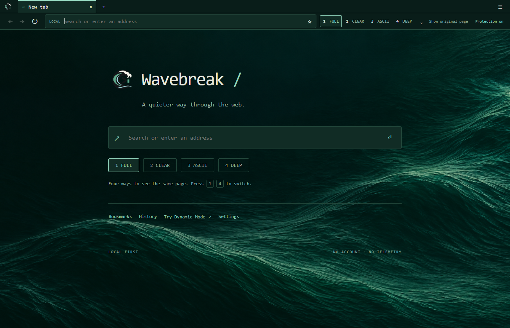
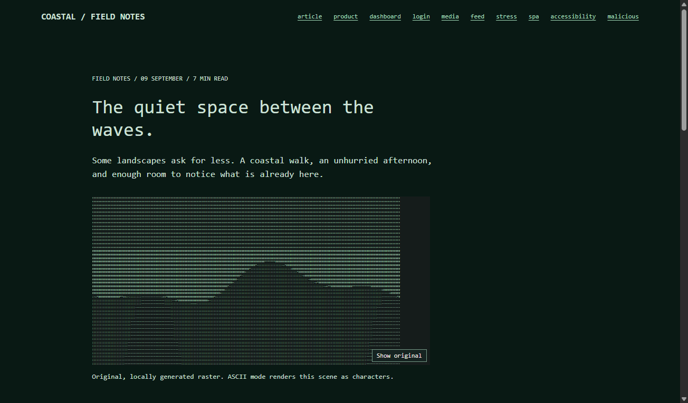
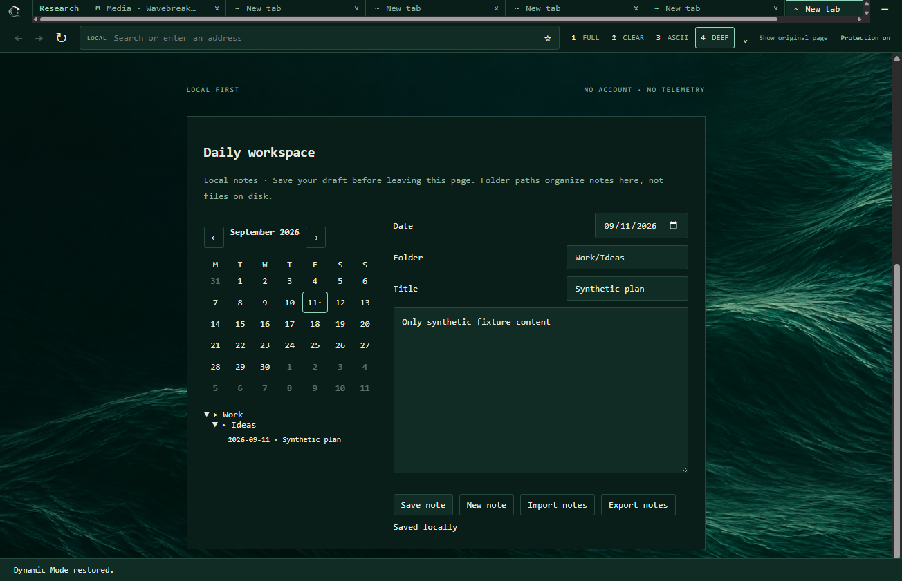

# Wavebreak

**A quieter way to browse, think and work.**

Wavebreak is a desktop browser and local workspace being developed in public from this alpha onward. It is not finished production software. Functionality, performance and integrated workspace features will evolve across alpha releases.

## Public Alpha

Current target: **0.1.0-alpha.6**.

Wavebreak is currently distributed as an unsigned Windows x64 alpha. Windows may show a SmartScreen warning. The source code is proprietary and is not published in this repository.

## What ships today

- Secure Electron browsing shell with isolated website views and local browser chrome.
- Tabs, tab groups, bookmarks, history, downloads, find, zoom, mute, print and fullscreen basics.
- Four Dynamic Modes:
  - **1 FULL**: regular page rendering with protection enabled.
  - **2 CLEAR**: lighter distraction filtering.
  - **3 ASCII**: terminal-inspired presentation with local ASCII conversion for eligible images and preserved primary video layout.
  - **4 DEEP**: stronger focus mode with secondary media/recommendations masked and simplified controls for supported media.
- Fast reversible mode switching for supported pages.
- Per-tab, site, session and global mode scope.
- Private sessions using isolated nonpersistent browsing partitions.
- Protection based on Ghostery/adblocker lists, with honest limits.
- 24 dark color palettes with phthalo green as the default.
- Optional Daily workspace and shared Markdown folder editing for local `.md` files.

## Stillpoint

Stillpoint is the direction for Wavebreak's integrated thinking and note-taking environment. The current alpha includes an optional Daily workspace and shared Markdown editing. Deeper Stillpoint integration, a standalone experience and richer workflows are future alpha work.

## Privacy

Wavebreak currently has no product account, no cloud sync and no in-app product analytics. Browsing still contacts the websites, search engines, media providers and filter-list providers you choose to use. Private sessions isolate local browsing state, but they do not make you anonymous to websites, networks or your internet provider.

Read the [privacy notice](PRIVACY.md).

## Downloads

Official public builds will be attached to [GitHub Releases](https://github.com/rimedag/wavebreak/releases).

For `0.1.0-alpha.6`, the intended Windows release assets are:

- `Wavebreak-Portable-0.1.0-alpha.6-x64.exe`
- `Wavebreak-Setup-0.1.0-alpha.6-x64.exe`

Only download Wavebreak from an official release. The repository ZIP is documentation, not the application.

## Platforms

| Platform | Status |
| --- | --- |
| Windows x64 | Alpha build prepared and tested locally. |
| macOS | Planned; no public build yet. |
| Linux | Planned; no public build yet. |
| iPadOS / iOS | Future product direction. |

## Roadmap

Wavebreak's roadmap is organized by themes, not promised dates. See [ROADMAP.md](ROADMAP.md).

## Feedback

Use Issues for reproducible bugs and feature requests. Use Discussions for ideas, questions and alpha feedback.

Do not post passwords, cookies, browsing history, private notes, private URLs or vulnerability details publicly. Report security issues through the private channel described in [SECURITY.md](SECURITY.md).

## Proprietary Notice

Wavebreak is free proprietary software. You may download and use official released application builds under the included terms. The source code is private and no open-source license is granted.

See [LICENSE.md](LICENSE.md) and [EULA.md](EULA.md).

